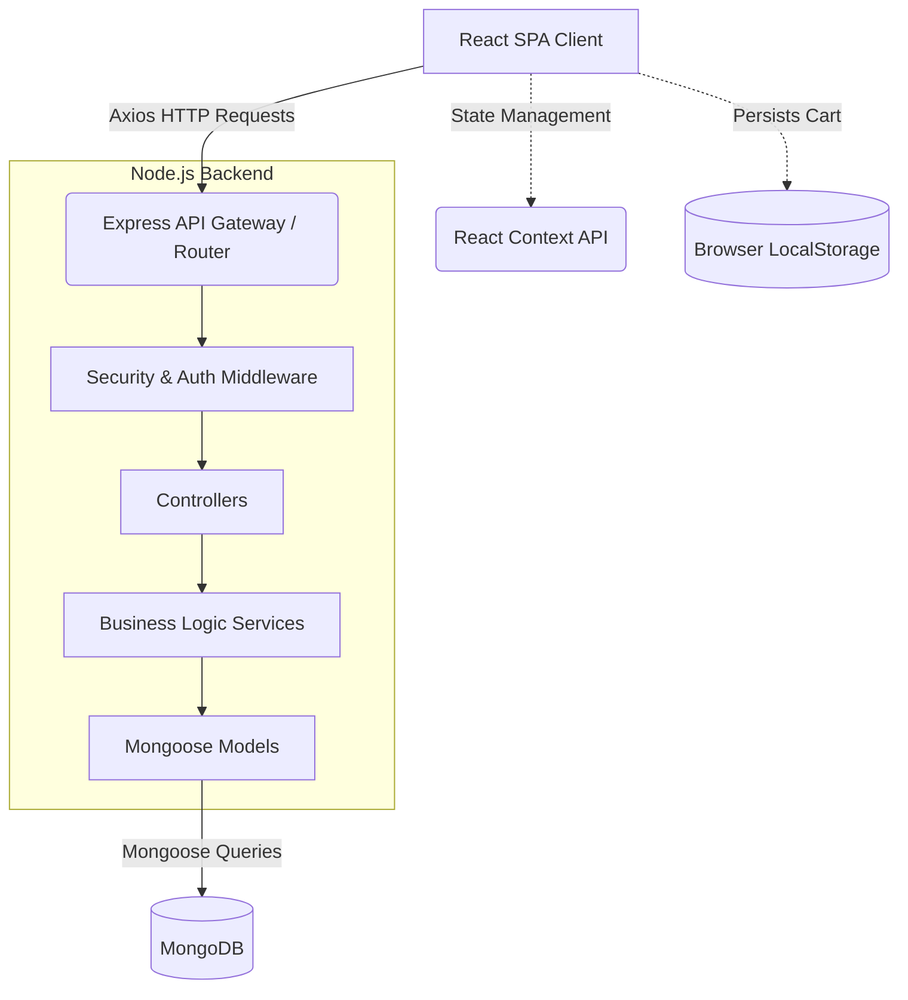
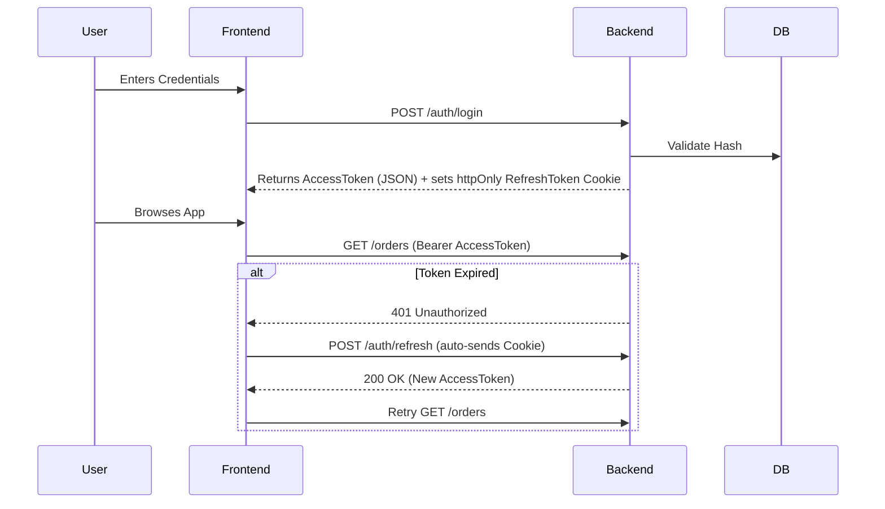
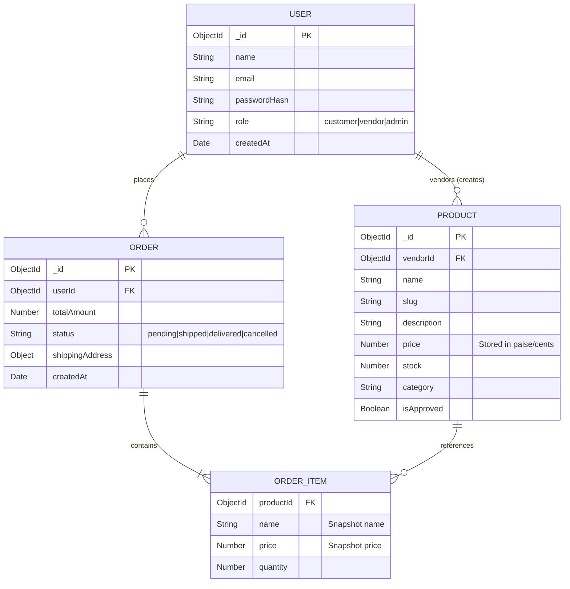

# System Architecture & Database Design

ShopEZ is built on a scalable, monolithic MERN stack architecture with clear separation of concerns.

## 1. High-Level Architecture Diagram

## 2. Security Flow (JWT Authentication)

## 3. Database Entity Relationship Diagram (ERD)

The database schema is designed to ensure historical immutability. When an order is placed, product prices and names are "frozen" in the Order document so that future price changes do not alter historical receipts.

